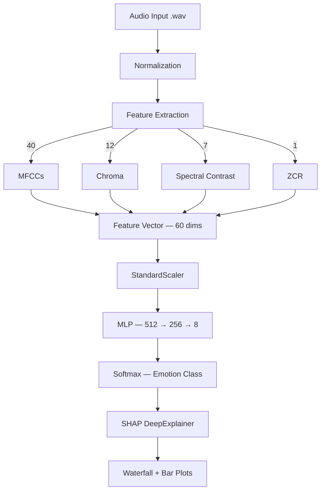

# 🎙️ Aural Sentiment Engine — Speech Emotion Recognition

> A machine learning-powered Speech Emotion Recognition system that decodes human emotions from voice recordings — with real-time predictions, SHAP explainability, and a premium dark UI.

---

## 🔗 Live Demo

🌐 **Deployed App:** [aural-sentiment-engine.streamlit.app](https://aural-sentiment-engine.streamlit.app)

| Home — Data Ingestion | Neural Inference Report | Explainability Lab |
|---|---|---|
|  |  |  |

> 💡 **Replace the placeholder image links above** with actual screenshots from your deployed app. Go to your app → take screenshots → upload to your GitHub repo's Issues tab → copy the image URLs.

---

## 🧱 Tech Stack


---

## ✨ Key Features

**🎤 Real-Time Emotion Prediction**
- Upload any `.wav` audio file and get instant emotion classification
- Supports 8 emotions: `Neutral` `Calm` `Happy` `Sad` `Angry` `Fear` `Disgust` `Surprise`
- Confidence score displayed per prediction with a full probability distribution bar chart

**🧠 60-Feature Audio Analysis**
- 40 MFCCs (Mel-Frequency Cepstral Coefficients) — captures tonal characteristics
- 12 Chroma features — captures harmonic content
- 7 Spectral Contrast features — captures dynamic range across frequency bands
- 1 Zero Crossing Rate — captures signal noisiness

**📊 Visual Insights Dashboard**
- Pre-trained Confusion Matrix showing per-class prediction performance
- Multi-class ROC Curve with AUC scores for all 8 emotion classes
- Cross-Validation Accuracy chart across 5 training folds

**🔍 SHAP Explainability (XAI)**
- Per-sample SHAP DeepExplainer analysis on every uploaded audio
- Top 10 most influential features shown in a ranked table
- Feature Weight Bar chart highlighting what drove the prediction
- Neural Path Waterfall Chart breaking down the model's decision

**🎨 Premium Dark UI**
- Sidebar navigation with 3 pages: Home Analyze, Visual Insights, Explainability
- Glassmorphism card design with hover effects
- Orbitron + Inter font pairing for a futuristic aesthetic
- Lottie animations during neural scan processing

---

## 🚀 Installation & Setup

```bash
# Clone the repository
git clone https://github.com/nivethitha-code/aural-sentiment-engine.git
cd aural-sentiment-engine

# Create virtual environment (Python 3.11 required)
python -m venv venv

# Activate virtual environment
# Windows:
venv\Scripts\activate
# Mac/Linux:
source venv/bin/activate

# Install dependencies
pip install -r requirements.txt

# Run the app
streamlit run app.py
```

App opens at → `http://localhost:8501`

---

## 🧠 Model Assets

Ensure the following files are in the `models/` directory before running:

```
models/
├── AuralSentimentEngine_best.keras   ← trained MLP model
├── scaler.joblib                     ← fitted StandardScaler
└── encoder.joblib                    ← fitted LabelEncoder
```

If files are missing, the app auto-downloads them from Google Drive on startup via `setup.py`.

To retrain the model from scratch:
```bash
# Step 1 — Extract features from RAVDESS dataset
python mlp_feature_extraction.py     # generates ravdess_features.csv

# Step 2 — Train the model
python mlp_model_training.py         # saves model + visuals
```

---

## 🧬 Model Architecture & Logic



**Training Strategy:**
- Dataset: RAVDESS (1,440 audio samples, 24 actors, 8 emotions)
- Validation: Stratified 5-Fold Cross Validation
- Best Fold Accuracy: **95.2%**
- Optimizer: Adam | Loss: Categorical Crossentropy
- Early Stopping: patience=10 on `val_accuracy`

---

## 📈 Model Performance

| Metric | Score |
|---|---|
| Best Fold Accuracy | **95.2%** |
| Average CV Accuracy | **~94.1%** |
| AUC (Angry, Calm, Fear, Happy, Neutral, Surprise) | **1.00** |
| AUC (Disgust, Sad) | **0.99** |

---

## 📂 Project Structure

```
aural-sentiment-engine/
├── app.py                      ← Main Streamlit application
├── setup.py                    ← Auto-download model assets from Google Drive
├── mlp_feature_extraction.py   ← Feature extraction from RAVDESS audio
├── mlp_model_training.py       ← Model training + saves .keras & .joblib
├── requirements.txt            ← Python dependencies
├── .streamlit/
│   └── config.toml             ← Dark theme configuration
├── models/                     ← Trained model files (not in git)
│   ├── AuralSentimentEngine_best.keras
│   ├── scaler.joblib
│   └── encoder.joblib
└── visuals/                    ← Pre-saved training plots
    ├── confusion_matrix.png
    ├── roc_curve.png
    └── cv_accuracy.png
```

---

## 💡 How It Works

1. **Upload** a `.wav` audio file on the Home Analyze page
2. Click **EXECUTE NEURAL SCAN** — the model extracts 60 acoustic features
3. The MLP predicts the **dominant emotion** with a confidence score
4. Switch to **Visual Insights** to see global model performance charts
5. Switch to **Explainability** to see exactly *which features* drove the prediction for your specific audio

---

## 📚 Key Learnings & Challenges

- **Feature consistency**: The same 60 features extracted during training must be extracted identically at inference time — any mismatch in feature order or normalization causes wrong predictions
- **SHAP with Keras**: `DeepExplainer` requires careful handling of expected values when the model has multiple output classes — needed to index `expected_value[pred_idx]` correctly
- **Cloud deployment**: TensorFlow doesn't support Python 3.12/3.13 — had to enforce Python 3.11 via `runtime.txt` on Streamlit Cloud
- **Large model files**: `.keras` files can't be pushed to GitHub (100MB limit) — solved by hosting on Google Drive and auto-downloading via `gdown` at startup
- **CSS on Streamlit Cloud**: `overflow: hidden` in custom CSS hid the sidebar on cloud even though it worked locally — cloud renders CSS slightly differently than local browsers

---

## 📄 License & Author

MIT License © 2026

**D Nivethitha** — [LinkedIn](https://www.linkedin.com/in/nivethitha-d-306a46326/) · [GitHub](https://github.com/nivethitha-code) · nivethithadharmarajan25@gmail.com
