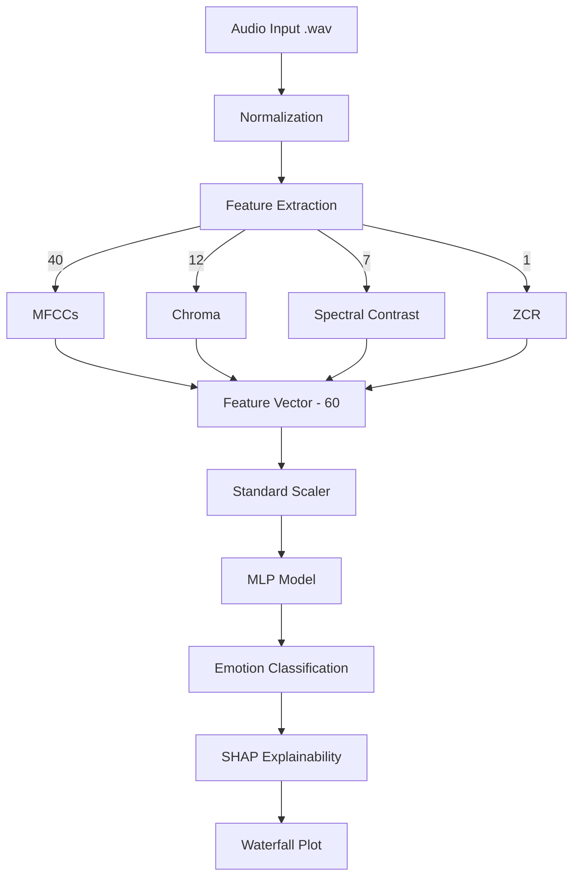

# 🎤 Aural Sentiment Engine — Speech Emotion Recognition

A high-performance Speech Emotion Recognition (SER) system built with **Python**, **Librosa**, and **TensorFlow**. This engine extracts rich spectral features from human voice recordings and classifies them into distinct emotions using a Deep Learning MLP model, with built-in **XAI (Explainable AI)** using SHAP.

---

## 🚀 Key Features

*   **Multi-Feature Extraction**: Combines 60 features (40 MFCCs, 12 Chroma, 7 Spectral Contrast, 1 ZCR) for robust signal analysis.
*   **Deep Learning MLP**: Trained on the **RAVDESS** dataset with Stratified K-Fold validation.
*   **SHAP Explainability**: Provides per-sample "Waterfall" and "Bar" plots to show exactly which audio features influenced the model's decision.
*   **Interactive Streamlit UI**: Real-time prediction, probability distribution charts, and model performance visuals.
*   **Auto-Deployment Ready**: Logic to download large model assets from external storage on startup.

---

## 🛠️ Tech Stack

*   **Audio Processing**: `librosa`, `soundfile`
*   **Modeling**: `TensorFlow`, `Keras`, `Scikit-learn`
*   **Explainability**: `SHAP`
*   **Dashboard**: `Streamlit`
*   **Data Handling**: `Numpy`, `Pandas`

---

## 📦 Installation & Setup

### 1. Prerequisite
*   **Python 3.12** is required.

### 2. Clone and Setup
```bash
# Create Virtual Environment
python -m venv venv

# Activate
# On Windows:
.\venv\Scripts\activate

# Install Dependencies
pip install -r requirements.txt
```

### 3. Model Assets
Ensure you have the following files in the `models/` directory:
- `AuralSentimentEngine_best.keras`
- `scaler.joblib`
- `encoder.joblib`

*(If not present, the app will attempt to download them automatically if File IDs are configured in `setup.py`.)*

---

## 🚦 How to Run

```bash
streamlit run app.py
```

---

## 🧠 Model Architecture & Logic



---

## 📂 Project Structure

*   `app.py`: Main Streamlit application.
*   `setup.py`: Asset download and environment setup utility.
*   `requirements.txt`: Python dependencies.
*   `models/`: Saved model, scaler, and encoder files.
*   `visuals/`: Static performance charts.
*   `RAVDESS DATASET/`: Training data source.

---

## 🏆 Deployment Status
*   [x] Environment compatible (Python 3.12)
*   [x] Feature Extraction logic verified
*   [x] UI/UX Improvements added
*   [ ] External Asset IDs verified in `setup.py`
